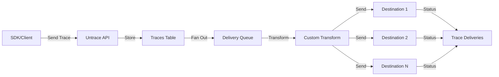

# Untrace: Trace Storage System Guide

## Overview

The Untrace trace storage system is designed to provide a flexible, extensible platform for collecting, storing, and distributing traces to multiple observability platforms. It supports both OpenTelemetry-compliant traces and custom trace formats.

## Architecture

### Core Components

1. **Traces Table** (`traces`)
   - Stores all incoming trace data with automatic TTL support
   - Uses JSONB for flexible data storage
   - Supports OpenTelemetry trace/span IDs
   - Automatically expires data after 30 days (configurable)

2. **Destination Providers** (`destinationProviders`)
   - Reference table of all available trace destinations
   - Stores configuration schemas for each provider
   - Defines provider capabilities (OpenTelemetry support, batching, etc.)

3. **Organization Destinations** (`orgDestinations`)
   - Per-organization configuration for each destination
   - Encrypted storage for API keys and secrets
   - Custom JavaScript transform functions
   - Retry and rate limiting configuration

4. **Trace Deliveries** (`traceDeliveries`)
   - Tracks delivery status for each trace to each destination
   - Enables retry logic with exponential backoff
   - Stores transformed payloads and error information

## Data Flow



## Key Features

### 1. TTL Support
- Traces automatically expire after a configurable period (default: 30 days)
- Helps manage storage costs and comply with data retention policies
- Can be customized per organization or trace type

### 2. Fan-Out Delivery
- Single trace can be sent to multiple destinations
- Each destination is processed independently
- Failures in one destination don't affect others

### 3. Custom Transformations
- JavaScript-based transform functions per destination
- Access to trace data and destination configuration
- Enables format conversion for non-OpenTelemetry destinations

### 4. Retry Logic
- Configurable retry attempts and delays
- Exponential backoff for failed deliveries
- Dead letter queue for permanently failed deliveries

### 5. Rate Limiting
- Per-destination rate limits
- Prevents overwhelming downstream services
- Automatic queuing and throttling

## Adding a New Provider

To add a new trace destination provider:

1. **Update the schema** in `packages/db/src/schema.ts`:
```typescript
export const destinationTypeEnum = pgEnum('destinationType', [
  // ... existing types ...
  'your_new_provider',
]);
```

2. **Add provider configuration** in `packages/db/src/seed-destination-providers.ts`:
```typescript
{
  type: 'your_new_provider' as const,
  name: 'Your Provider Name',
  description: 'Description of your provider',
  configSchema: {
    type: 'object',
    required: ['apiKey'],
    properties: {
      apiKey: { type: 'string', description: 'API key' },
      endpoint: { type: 'string', description: 'API endpoint' },
      // Add other configuration fields
    },
  },
  supportsOpenTelemetry: true,
  supportsCustomTransform: true,
  supportsBatchDelivery: false,
}
```

3. **Implement the delivery adapter** (in your application code):
```typescript
export class YourProviderAdapter implements TraceDeliveryAdapter {
  async deliver(trace: TraceType, config: any): Promise<void> {
    // Implementation
  }
}
```

## Configuration Examples

### Langfuse Configuration
```json
{
  "publicKey": "pub_xxx",
  "secretKey": "secret_xxx",
  "baseUrl": "https://cloud.langfuse.com"
}
```

### Webhook Configuration
```json
{
  "url": "https://your-endpoint.com/traces",
  "headers": {
    "Authorization": "Bearer token",
    "X-Custom-Header": "value"
  },
  "method": "POST",
  "timeout": 30000
}
```

### Custom Transform Example
```javascript
function transform(trace, destination) {
  // Convert OpenTelemetry format to custom format
  return {
    timestamp: trace.createdAt,
    traceId: trace.traceId,
    spans: trace.data.spans.map(span => ({
      id: span.spanId,
      name: span.name,
      duration: span.endTime - span.startTime,
      attributes: span.attributes
    })),
    metadata: {
      service: destination.config.service || 'default',
      environment: destination.config.env || 'production'
    }
  };
}
```

## Security Considerations

1. **Encryption**: All sensitive configuration (API keys, secrets) should be encrypted at the application layer before storing
2. **Access Control**: Use row-level security to ensure organizations can only access their own configurations
3. **Transform Sandboxing**: Execute custom transforms in a sandboxed environment to prevent code injection
4. **Rate Limiting**: Implement rate limiting to prevent abuse and protect downstream services

## Performance Optimization

1. **Batch Processing**: Group traces for destinations that support batch delivery
2. **Async Processing**: Use background jobs for trace delivery to avoid blocking the main API
3. **Connection Pooling**: Reuse HTTP connections for frequent deliveries
4. **Indexing**: Add indexes on frequently queried columns (traceId, orgId, status)

## Monitoring and Alerting

Monitor these key metrics:
- Trace ingestion rate
- Delivery success/failure rates per destination
- Average delivery latency
- Queue depth for pending deliveries
- Storage usage and TTL effectiveness

## Database Migrations

Run migrations to create the new tables:
```bash
npm run db:generate
npm run db:migrate
```

Seed the destination providers:
```bash
npm run db:seed-providers
```

## Example Usage

### Storing a Trace
```typescript
const trace = await db.insert(Traces).values({
  traceId: otelTrace.traceId,
  spanId: otelTrace.spanId,
  data: otelTrace,
  orgId: currentOrg.id,
  userId: currentUser.id,
  expiresAt: new Date(Date.now() + 7 * 24 * 60 * 60 * 1000), // 7 days
});
```

### Configuring a Destination
```typescript
const destination = await db.insert(OrgDestinations).values({
  orgId: currentOrg.id,
  providerId: langfuseProvider.id,
  name: 'Production Langfuse',
  config: await encrypt({
    publicKey: 'pub_xxx',
    secretKey: 'secret_xxx',
  }),
  isEnabled: true,
  retryEnabled: true,
  maxRetries: 3,
});
```

### Processing Deliveries
```typescript
// Get pending deliveries
const pending = await db.query.traceDeliveries.findMany({
  where: eq(traceDeliveries.status, 'pending'),
  with: {
    trace: true,
    destination: {
      with: {
        provider: true,
      },
    },
  },
});

// Process each delivery
for (const delivery of pending) {
  await processDelivery(delivery);
}
```